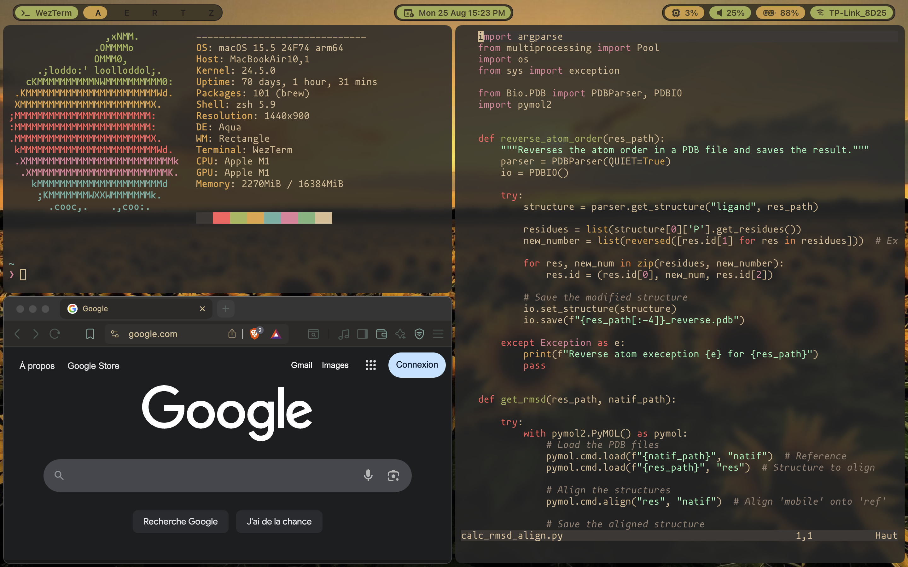

# Mac Dotfiles

These are my personal **dotfiles** for my workflow on an **M1 MacBook**.  
They include configurations for:

- **Neovim (Nvim)** → my main editor  
- **Aerospace** → tiling window manager for macOS  
- **SketchyBar** → customizable macOS status bar  

Note: I use a French **AZERTY** keyboard, which may explain some unusual key mappings.

## Preview

Here’s what my setup looks like:

---

## Inspiration

This setup is inspired by [Josean’s workflow](https://www.josean.com).

---

If you want something similar, check out Josean’s tutorials or use my config as a base for your own. :)
